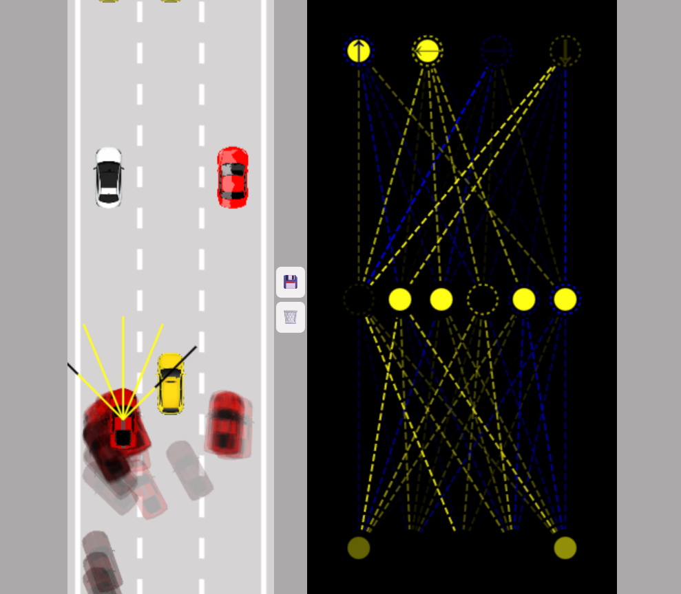
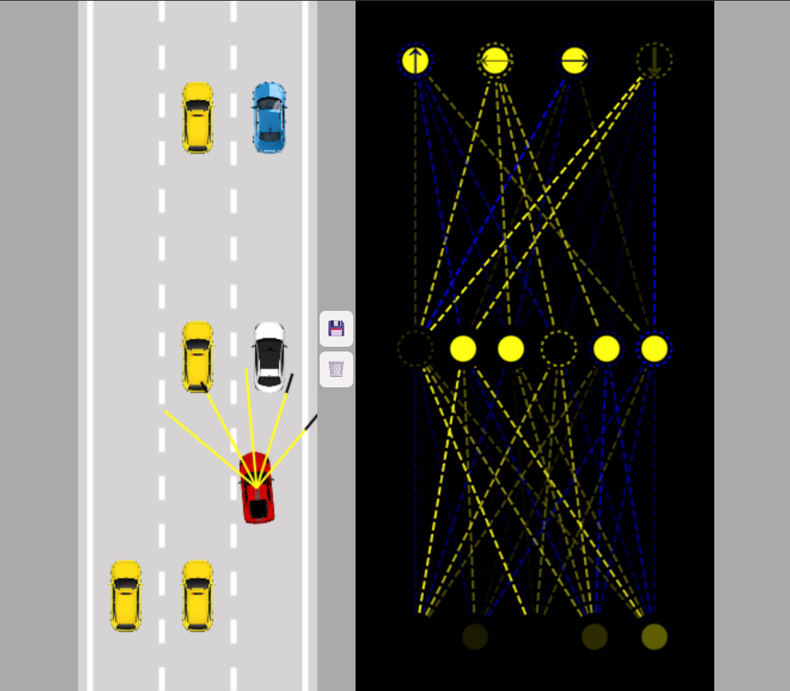

# 🚗 Self-Driving Car Simulation

An interactive **self-driving car simulation** built with vanilla **JavaScript** and **HTML5 Canvas**.  
This project explores how a car can learn to drive itself using a **neural network** and sensors, without any external libraries.

---

## ✨ Features
- Procedurally generated **road** with multiple lanes  
- **Player car** controlled by keyboard or AI  
- **Traffic cars** with different sprites for obstacles  
- **Neural network** controlling AI cars, trained through mutation  
- **Sensors** detect road borders and nearby cars  
- Collision detection (cars turn grey when damaged)  
- Clean rendering of cars, traffic, and neural net  

---

## 🚀 Getting Started

### Clone the repo
```bash
git clone https://github.com/shrikantbk06/self-driving-car.git
cd self-driving-car
```

### Run locally

Just open **index.html** in your browser – no build step needed.
(If using VS Code, install the Live Server extension and run directly.)

## How It Works
 - The AI cars start with random neural networks.
 - At each frame, their sensors provide input to the network.
 - The outputs decide steering, acceleration, and braking.
 - The best performing car’s “brain” can be saved in **localStorage** for future runs.

## Screenshots






